# CQC Rating Predictor - System Architecture

## Table of Contents
1. [High-Level Architecture](#high-level-architecture)
2. [Data Flow Architecture](#data-flow-architecture)
3. [Component Architecture](#component-architecture)
4. [Security Architecture](#security-architecture)
5. [Deployment Architecture](#deployment-architecture)
6. [Database Schema](#database-schema)
7. [API Architecture](#api-architecture)
8. [ML Pipeline Architecture](#ml-pipeline-architecture)

## High-Level Architecture

### System Overview
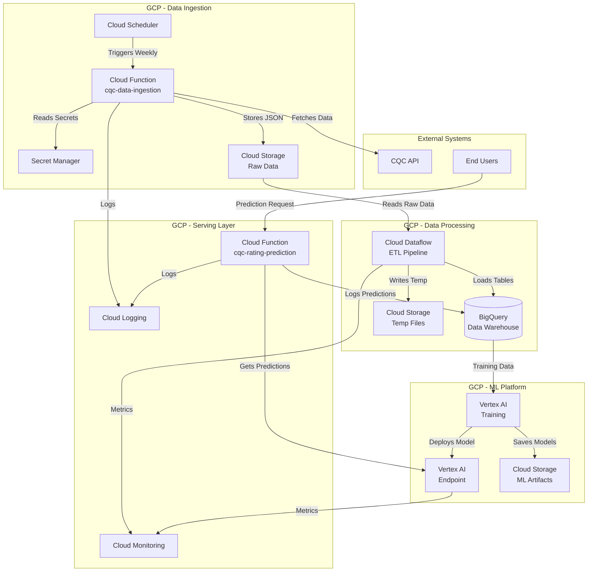

## Data Flow Architecture

### End-to-End Data Pipeline
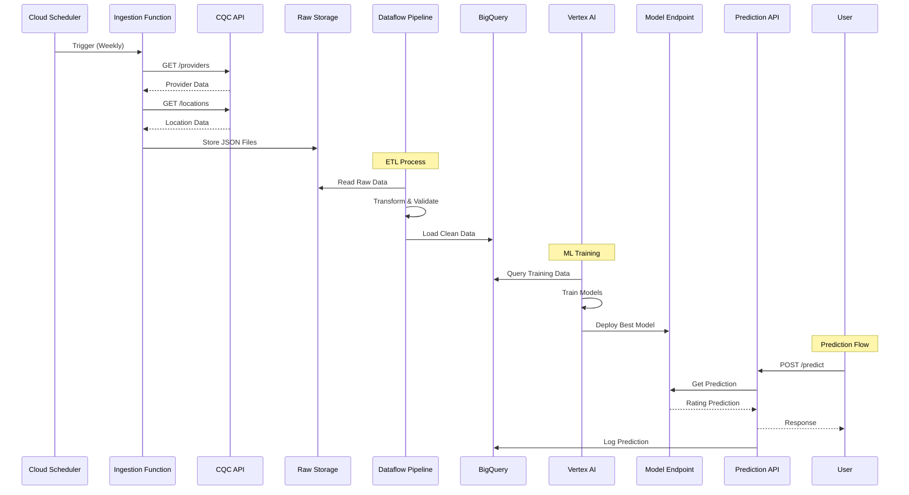

## Component Architecture

### Microservices Architecture
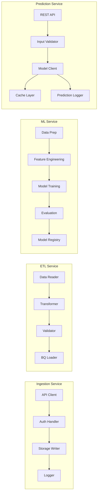

### Component Details

| Component | Technology | Purpose | Scaling |
|-----------|------------|---------|---------|
| Ingestion Function | Cloud Functions (Python) | Fetch CQC data | Auto-scaling 0-100 |
| ETL Pipeline | Apache Beam on Dataflow | Transform and load data | Auto-scaling workers |
| ML Training | Vertex AI Pipelines | Train and evaluate models | Managed scaling |
| Prediction API | Cloud Functions (Python) | Serve predictions | Auto-scaling 0-1000 |
| Data Warehouse | BigQuery | Store and query data | Serverless |
| Model Registry | Vertex AI Model Registry | Version and manage models | Managed |
| Monitoring | Cloud Monitoring | System observability | Serverless |

## Security Architecture

### Security Layers
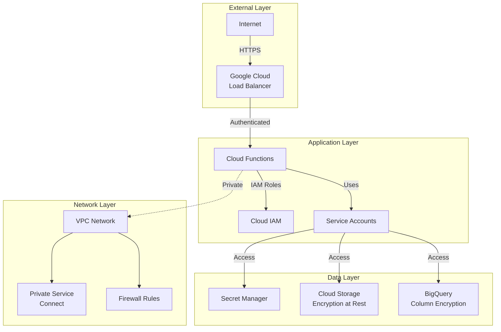

### Security Controls

| Layer | Control | Implementation |
|-------|---------|----------------|
| Authentication | API Keys | Secret Manager |
| Authorization | IAM Roles | Least privilege |
| Encryption | At Rest | Default GCS/BQ encryption |
| Encryption | In Transit | TLS 1.2+ |
| Network | Firewall | Deny all, allow specific |
| Audit | Logging | Cloud Audit Logs |
| Secrets | Management | Secret Manager with rotation |

## Deployment Architecture

### CI/CD Pipeline
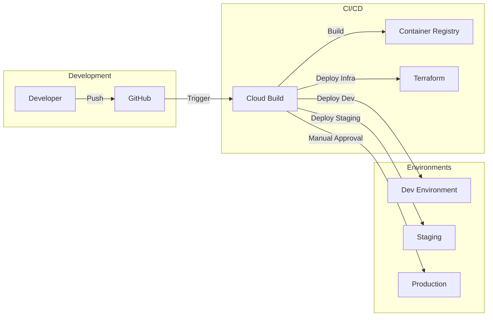

### Infrastructure as Code
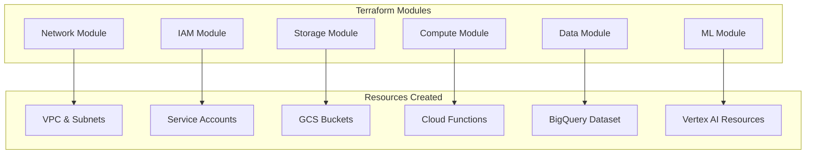

## Database Schema

### BigQuery Schema Design
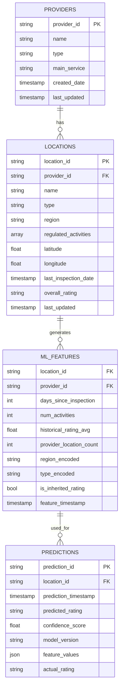

### Table Partitioning Strategy
- **locations**: Partitioned by `last_updated` (daily)
- **ml_features**: Partitioned by `feature_timestamp` (daily)
- **predictions**: Partitioned by `prediction_timestamp` (daily)
- **providers**: Partitioned by `last_updated` (monthly)

## API Architecture

### REST API Design
```mermaid
graph TD
    subgraph "API Gateway"
        EP1[/predict]
        EP2[/batch_predict]
        EP3[/health]
        EP4[/metrics]
    end
    
    subgraph "Request Processing"
        VAL[Input Validation]
        AUTH[Authentication]
        RL[Rate Limiting]
        CACHE[Cache Layer]
    end
    
    subgraph "Business Logic"
        PRED[Prediction Service]
        BATCH[Batch Service]
        MON[Monitoring Service]
    end
    
    EP1 --> VAL
    EP2 --> VAL
    EP3 --> MON
    EP4 --> MON
    
    VAL --> AUTH
    AUTH --> RL
    RL --> CACHE
    CACHE --> PRED
    CACHE --> BATCH
```

### API Endpoints

| Endpoint | Method | Purpose | Rate Limit |
|----------|--------|---------|------------|
| `/predict` | POST | Single prediction | 100/min |
| `/batch_predict` | POST | Batch predictions | 10/min |
| `/health` | GET | Health check | 1000/min |
| `/metrics` | GET | Service metrics | 100/min |

### Request/Response Format

**Prediction Request:**
```json
{
  "instances": [{
    "location_id": "1-12345",
    "provider_id": "1-67890",
    "days_since_last_inspection": 180,
    "num_regulated_activities": 5,
    "region": "London",
    "type": "Residential social care",
    "historical_rating_avg": 3.5
  }]
}
```

**Prediction Response:**
```json
{
  "predictions": [{
    "location_id": "1-12345",
    "predicted_rating": "Good",
    "confidence": 0.85,
    "rating_probabilities": {
      "Outstanding": 0.10,
      "Good": 0.85,
      "Requires improvement": 0.04,
      "Inadequate": 0.01
    },
    "model_version": "cqc-xgboost-v2.1"
  }]
}
```

## ML Pipeline Architecture

### Training Pipeline
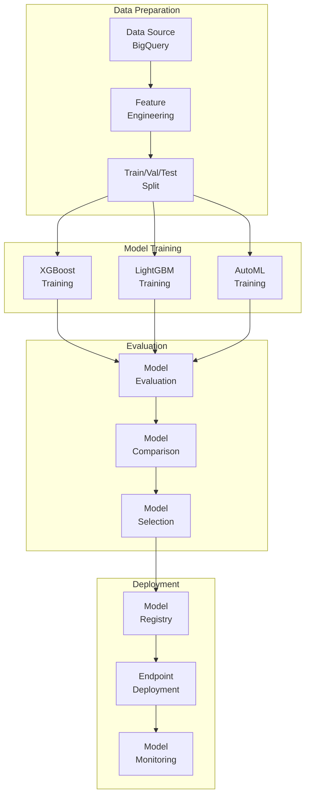

### Feature Engineering Pipeline
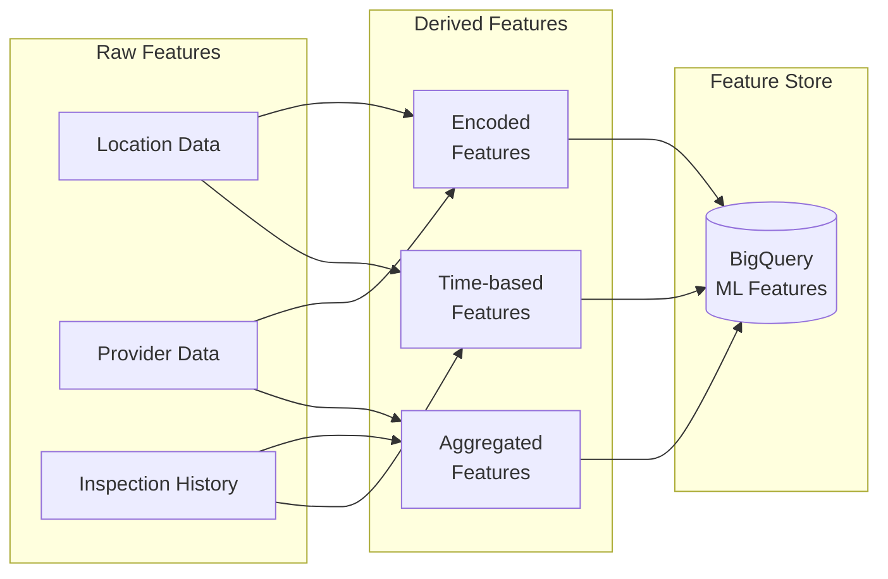

### Model Monitoring Architecture
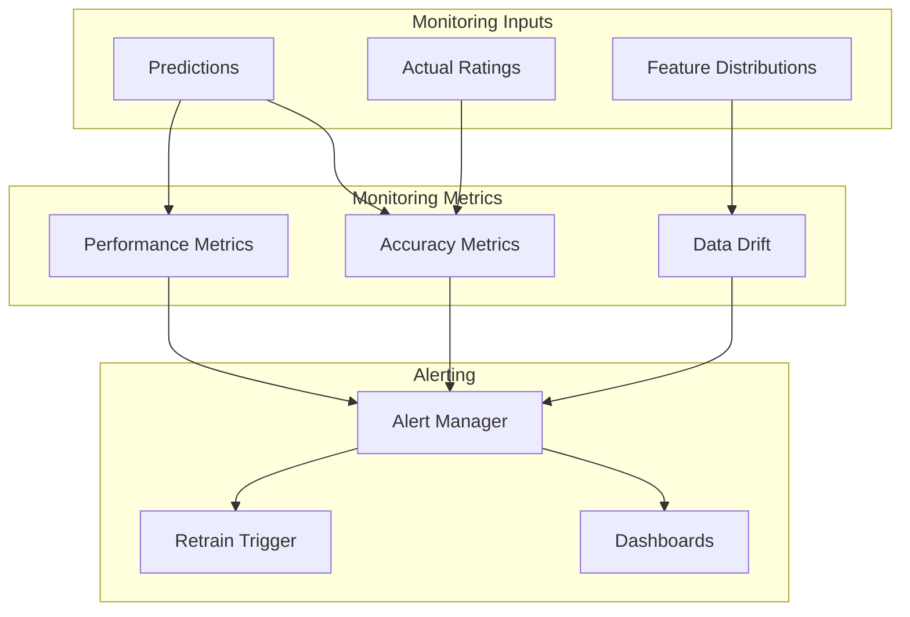

## Performance Architecture

### Caching Strategy
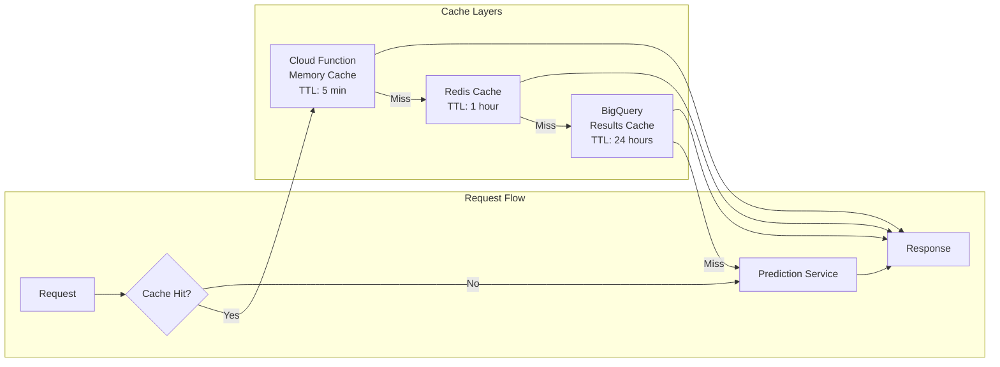

### Scaling Architecture
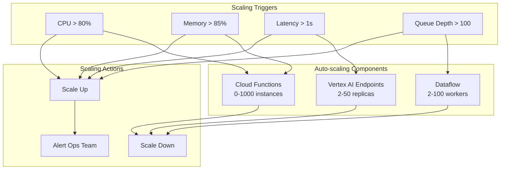

## Cost Optimization Architecture

### Resource Lifecycle
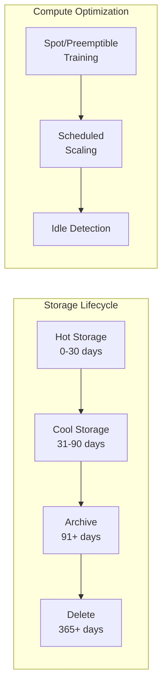

## Disaster Recovery Architecture

### Multi-Region Setup
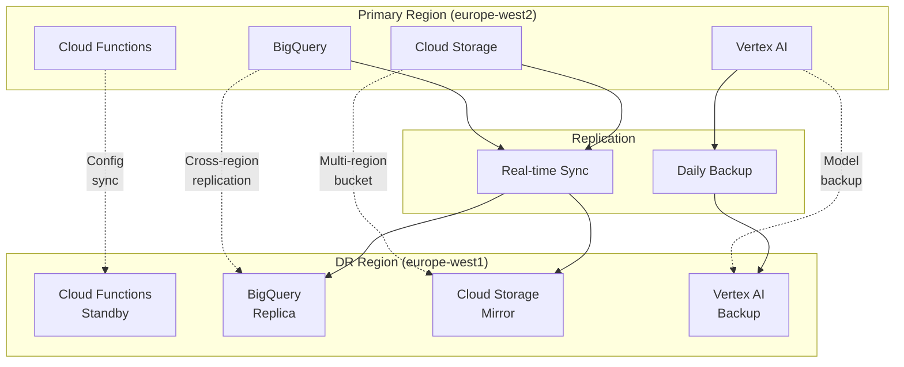

## Summary

This architecture provides:
- **Scalability**: Auto-scaling across all components
- **Reliability**: Multi-region DR, health checks, monitoring
- **Security**: Defense in depth, encryption, IAM
- **Performance**: Caching, CDN, optimized queries
- **Cost Efficiency**: Lifecycle policies, spot instances, serverless

The system is designed to handle:
- 1M+ predictions per day
- 100GB+ data ingestion weekly
- Sub-second prediction latency
- 99.9% availability SLA